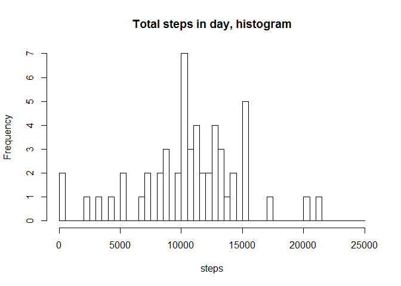
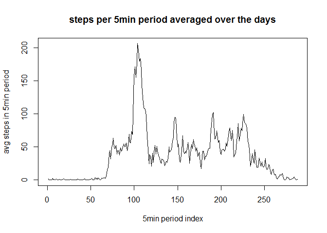
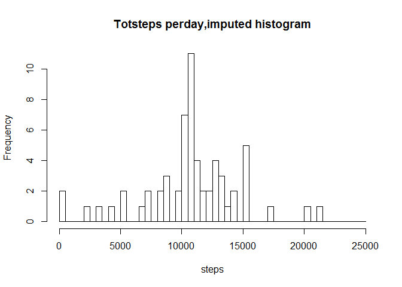
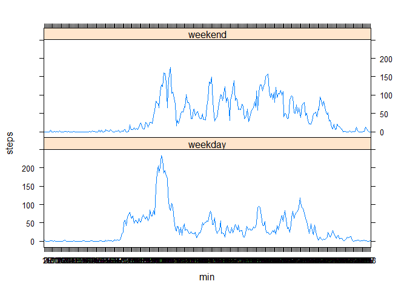

# Reproducible Research: Peer Assessment 1

#author:Dirk Bruyland 21feb2016
##Introduction
Be sure to have the unzipped data file in your WD.


## Loading and preprocessing the data

```r
dir()
```

```
## [1] "activity.csv"              "PA1_template.html"        
## [3] "PA1_template.md"           "PA1_template.Rmd"         
## [5] "PA1_template_files"        "repdata-data-activity.zip"
## [7] "RepData_PeerAssessment1"
```

```r
dtx<-read.csv("activity.csv", stringsAsFactors = TRUE)
str(dtx)
```

```
## 'data.frame':	17568 obs. of  3 variables:
##  $ steps   : int  NA NA NA NA NA NA NA NA NA NA ...
##  $ date    : Factor w/ 61 levels "2012-10-01","2012-10-02",..: 1 1 1 1 1 1 1 1 1 1 ...
##  $ interval: int  0 5 10 15 20 25 30 35 40 45 ...
```
further analysis shows dt has 61 consecutive days (from 1 oct 2012)
of movement stored, for each day 288 rows 61*288=17568.  
When NA occurs it occurs for the whole day.No NAs in other positions.  
the 5min interval identifier "interval" is of format hhmm:after 1255 the identifier 1300 .


## What is mean total number of steps taken per day?

```r
#tsd Vector contains total nr steps for each day
tsd<-aggregate(dtx$steps,by=list(dtx$date),FUN=sum,simplify=TRUE)
str(tsd)
```

```
## 'data.frame':	61 obs. of  2 variables:
##  $ Group.1: Factor w/ 61 levels "2012-10-01","2012-10-02",..: 1 2 3 4 5 6 7 8 9 10 ...
##  $ x      : int  NA 126 11352 12116 13294 15420 11015 NA 12811 9900 ...
```

```r
#The mean nr of steps in a day
mean(tsd$x,na.rm=TRUE)
```

```
## [1] 10766.19
```

```r
#The median of  nr of steps in a day
median(tsd$x,na.rm=TRUE)
```

```
## [1] 10765
```


```r
hist(tsd$x,breaks=seq(0,25000,500),xlab="steps",main="Total steps in day, histogram")
```


  
    
      
      
Note "frequency" (the y axis) denotes the nr of days that have a total number of steps in a day that is in the respective bins of the histogram.  
bin size of 500 selected.

## What is the average daily activity pattern?

```r
#I iadd a factor variable  "min" to dtx that associates with every obs "the"" 5 minute   
#periode in the #day, so similar 5 min periods across diferent days have same "min".
min <- rep(seq(1,288,1),61)
dtx<-cbind(dtx,min)
dtxt<- transform(dtx,min=factor(min))

#tsm contains mean nr of steps in 5min period, over all 61days so it has length 288. 
tsm<-aggregate(dtx$steps,by=list(dtxt$min),FUN=mean,na.rm=T,simplify=T)
str(tsm)
```

```
## 'data.frame':	288 obs. of  2 variables:
##  $ Group.1: Factor w/ 288 levels "1","2","3","4",..: 1 2 3 4 5 6 7 8 9 10 ...
##  $ x      : num  1.717 0.3396 0.1321 0.1509 0.0755 ...
```

```r
#max in tsm vector is the period with min identifier:
which.max(tsm$x)
```

```
## [1] 104
```

```r
#this is the morning period 08:40-08:45.

plot(tsm$x,type="l",xlab="5min period index",ylab="avg steps in 5min period",main="steps per 5min period averaged over the days")
```


 


## Imputing missing values

```r
#total NAs:
sum(is.na(dtx$steps))
```

```
## [1] 2304
```

```r
#IV is logical vector to access the NAs
#dtx_I is the updated dtx
#the strategy for imputing is to plug in  the 5min Average(from tsm variable) when 5min=NA
IV<- is.na(dtx$steps)
str(IV)
```

```
##  logi [1:17568] TRUE TRUE TRUE TRUE TRUE TRUE ...
```

```r
dtx_I<-dtx
dtx_I[IV,1] <- tsm[dtx[IV,4],2]

#tsd_I Vector contains total nr steps for each day, imputed
tsd_I<-aggregate(dtx_I$steps,by=list(dtx_I$date),FUN=sum,simplify=TRUE)

#The mean nr of steps in a day, imputed
mean(tsd_I$x,na.rm=TRUE)
```

```
## [1] 10766.19
```

```r
#The median of  nr of steps in a day, imputed
median(tsd_I$x,na.rm=TRUE)
```

```
## [1] 10766.19
```


```r
hist(tsd_I$x,breaks=seq(0,25000,500),xlab="steps",main="Totsteps perday,imputed histogram")
```


note: mean and median do not change a lot, but in the hist the frequency around the mean/median is higher due to the method of imputing.


## Are there differences in activity patterns between weekdays and weekends?


```r
#1 oct 2010 was a monday
weekdays(as.Date("2012-10-01"))
```

```
## [1] "Monday"
```

```r
#we add a new factor var to dtx  
#for this we first create a slightly larger vector 
#with the ocrrect values weekday/weekend
#has to be larger to make an integral numberfor the rep() functions.
# 288*(5+2)*9=288*63=18144

y1<-c(rep(rep("weekday",288),5))
y2<-c(rep(rep("weekend",288),2))
y<-rep(c(y1,y2),9)
dtL<-cbind(dtx,y[1:17568])
dtLt<-transform(dtL,min=factor(min))
names(dtLt)[5]<-"we"
str(dtLt)
```

```
## 'data.frame':	17568 obs. of  5 variables:
##  $ steps   : int  NA NA NA NA NA NA NA NA NA NA ...
##  $ date    : Factor w/ 61 levels "2012-10-01","2012-10-02",..: 1 1 1 1 1 1 1 1 1 1 ...
##  $ interval: int  0 5 10 15 20 25 30 35 40 45 ...
##  $ min     : Factor w/ 288 levels "1","2","3","4",..: 1 2 3 4 5 6 7 8 9 10 ...
##  $ we      : Factor w/ 2 levels "weekday","weekend": 1 1 1 1 1 1 1 1 1 1 ...
```

```r
table(dtLt[5])
```

```
## 
## weekday weekend 
##   12960    4608
```

```r
tsmL<- aggregate(dtLt$steps,by=list(dtLt$min,dtLt$we),FUN=mean,na.rm=T,simplify=T)
names(tsmL)<-c("min","we","steps")

install.packages("lattice",repos="http://cran.us.r-project.org")
```

```
## package 'lattice' successfully unpacked and MD5 sums checked
## 
## The downloaded binary packages are in
## 	C:\Users\Waldorf\AppData\Local\Temp\RtmpQzrHuX\downloaded_packages
```

```r
library(lattice)
xyplot(steps~min|we,data=tsmL,layout=c(1,2),type="l")
```


note: as can be expected in the week there is more activity centered around the morning peak, whereas activity in weekend is more spread over the whole day. 

